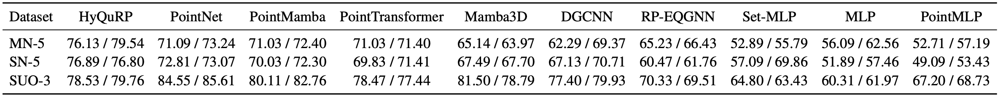

# HyQuRP

## Introduction
HyQuRP is a hybrid quantum–classical neural network for 3D point clouds that maintains rotational and permutational equivariance in its representations, enabling rotation- and permutation-invariant classification. We show that HyQuRP outperforms most classical and quantum state-of-the-art models on various datasets in the sparse point regime.


<p align="center">
  
</p>




---

## Installation

```bash
git clone https://github.com/YonseiQC/Equivariant_QML.git
cd Equivariant_QML
python3 -m pip install -U pip
python3 -m pip install -r requirements.txt
python3 -m pip uninstall -y jax jaxlib jax-cuda12-plugin jax-cuda12-pjrt jax_plugins # Cleanup (for clarity)
python3 -m pip install -r requirements-jax-cuda12.txt
```

> A CUDA 12 JAX backend is required to run the JAX-based models (HyQuRP, RP-EQGNN, Set-MLP) on GPU.

---


## Data

We use three object-level datasets with small-class subsets:

- **ModelNet-5**: bottle, bowl, cup, lamp, stool  
- **ShapeNet-5**: birdhouse, bottle, bowl, bus, cap  
- **Sydney Urban Objects-3 (SUO-3)**: car, traffic sign, pedestrian

### Download & place raw data

> After downloading, place the raw dataset folders under the paths below.

#### ModelNet (HDF5)

We use the ModelNet40 HDF5 release.

Download :
- https://huggingface.co/datasets/Msun/modelnet40/tree/d5dc795541800feeb7a4b3bd3142729a0d2adf7a

Put the extracted HDF5 folder under:

```text
data/ModelNet/modelnet40_ply_hdf5_2048/
  ply_data_train0.h5
  ply_data_train1.h5
  ...
  ply_data_test0.h5
  ...
```

#### ShapeNet (OBJ)

Download :
- https://huggingface.co/datasets/ShapeNet/ShapeNetCore/tree/main

Put synset folders under:

```text
data/ShapeNet/
  02843684/  # birdhouse
    <instance_id>/models/model_normalized.obj
  02876657/  # bottle
    <instance_id>/models/model_normalized.obj
  02880940/  # bowl
    <instance_id>/models/model_normalized.obj
  02924116/  # bus
    <instance_id>/models/model_normalized.obj
  02954340/  # cap
    <instance_id>/models/model_normalized.obj
```

#### Sydney Urban Objects 

Download :
- https://www.acfr.usyd.edu.au/papers/SydneyUrbanObjectsDataset.shtml

Put the extracted dataset under:

```text
data/Sydney_Urban_Objects/sydney-urban-objects-dataset/
  objects/
    car/ ...
    traffic_sign/ ...
    pedestrian/ ...
```

### Create NPZ files (sampling)

Each dataset folder provides a sampling script. The only required argument is `--num_points`.

From the repository root:

```bash
python <sampling_script.py> --num_points <NUM_POINTS>
```
- `<sampling_script.py>` : one of `data/ModelNet/modelnet_sampling.py`, `data/ShapeNet/shapenet_sampling.py`, `data/Sydney_Urban_Objects/SUO_sampling.py`

- `<NUM_POINTS>` : number of points per sample (e.g., 3, 4, 5, ...)

Example:
```bash
python data/ModelNet/modelnet_sampling.py --num_points 6
```

The generated `.npz` files will be saved into the corresponding dataset folder:

- `data/ModelNet/`
- `data/ShapeNet/`
- `data/Sydney_Urban_Objects/`


---

## HyQuRP Matrices

HyQuRP uses precomputed (normalized) permutation matrices stored in `HyQuRP/PermMatrix/`.

Generate them by running `HyQuRP/create_perm_matrix_normalized.py` once per `num_qubit`.

### Generate matrices

From the repository root:

```bash
python HyQuRP/create_perm_matrix_normalized.py --num_qubit <NUM_QUBIT>
```
>Note: the matrices have shape `(2**num_qubit, 2**num_qubit)`, so large num_qubit can be very memory/time intensive.

Example:
```bash
python HyQuRP/create_perm_matrix_normalized.py --num_qubit 8
```


Running the script will create / update:

- `HyQuRP/PermMatrix/perm_matrix_{num_qubit}_{num_perm}_plus_normalized.npy`
- `HyQuRP/PermMatrix/perm_matrix_{num_qubit}_{num_perm}_minus_normalized.npy`

where `num_perm` ranges from 2 to `(num_qubit // 2)`.

---

## HyQuRP & baselines

> Make sure the corresponding `.npz` file already exists under:
> `data/ModelNet/`, `data/ShapeNet/`, or `data/Sydney_Urban_Objects/`.


### Run HyQuRP

From the repository root:

```bash
python HyQuRP/HyQuRP.py <SEED> --dataset <DATASET> --num_qubit <NUM_QUBIT> --variant <VARIANT>
```

> Make sure the precomputed HyQuRP matrices are available in `HyQuRP/PermMatrix/`.

- `<DATASET>`: `modelnet`, `shapenet`, or `suo`
- `<VARIANT>`: `light` or `mid`
- `num_points = num_qubit // 2` (so `NUM_QUBIT` must be even)

### Run baselines

All baseline scripts live under `baselines/`. Use the same core flags:

```bash
python baselines/<BASELINE_MODEL>.py <SEED> --dataset <DATASET> --num_points <NUM_POINTS> --variant <VARIANT> [--extra_args ...]
```

- `<BASELINE_MODEL>`: the baseline script name (e.g., `DGCNN`, `PointNet`, ...)
- Some baselines may require extra arguments (e.g., `--k <K>` for kNN-based models).

Example:
```bash
python baselines/DGCNN.py 2026 --dataset modelnet --num_points 6 --variant light --k 3
```

### Output Results
Each run prints:
- an initial header with `seed`, `dataset`, `variant`, `num_points` (or `num_qubit`), `epochs`, and `lr`
- per-epoch logs in the format:
  `epoch E/T | train loss : ... | val loss : ... | val accuracy : ...`
- a final summary including final test accuracy and class-wise Accuracy

During training/evaluation, the script saves:
- Contains: combined console log (stdout/stderr), run config dump, and per-epoch/final metrics.
- Filenames: `<model>_<seed>_<dataset>_<num_points>_<variant>[_<k>].stdout.log`, `.config.json`, `.metrics.jsonl`.
- Saved to: repository root (`Equivariant_QML/`, i.e., the directory containing `data/`).


---

## Results

### ModelNet

#### Light Version

| points | n(seeds) |        MLP |    Set-MLP |   PointNet |      DGCNN |   PointMLP | Point Transformer | PointMamba |    Mamba3D |   RP‑EQGNN |     HyQuRP |
| -----: | -------: | ---------: | ---------: | ---------: | ---------: | ---------: | ----------------: | ---------: | ---------: | ---------: | ---------: |
|      4 |        7 | 58.5 ± 1.9 | 58.9 ± 3.0 | 64.0 ± 2.9 | 56.0 ± 1.6 | 53.1 ± 1.1 |        60.5 ± 4.0 | 63.7 ± 2.0 | 61.9 ± 2.2 | 58.6 ± 3.5 | 71.2 ± 1.5 |
|      5 |        7 | 55.2 ± 1.5 | 63.5 ± 1.9 | 67.7 ± 5.0 | 58.5 ± 1.4 | 55.3 ± 2.3 |        61.8 ± 8.6 | 68.3 ± 2.2 | 61.8 ± 1.8 | 62.6 ± 2.8 | 75.0 ± 2.2 |
|      6 |        7 | 56.0 ± 5.5 | 69.2 ± 1.2 | 71.1 ± 1.7 | 62.2 ± 1.6 | 52.7 ± 2.3 |        71.0 ± 1.8 | 71.0 ± 1.4 | 65.1 ± 2.6 | 65.2 ± 2.4 | 76.1 ± 2.0 |

#### Mid Version

| points | n(seeds) |        MLP |    Set-MLP |   PointNet |      DGCNN |   PointMLP | Point Transformer | PointMamba | Mamba3D | RP‑EQGNN |     HyQuRP |
| -----: | -------: | ---------: | ---------: | ---------: | ---------: | ---------: | ----------------: | ---------: | ------: | -------: | ---------: |
|      4 |        7 | 59.0 ± 1.0 | 58.9 ± 1.7 | 68.5 ± 3.3 | 58.5 ± 1.2 | 57.8 ± 1.2 |        62.7 ± 0.4 | 66.3 ± 3.3 |         |          |            |
|      5 |        7 | 59.7 ± 1.1 | 64.6 ± 2.1 | 69.0 ± 3.2 | 62.5 ± 1.7 | 59.8 ± 1.6 |        66.0 ± 1.8 | 72.5 ± 1.9 |         |          | 74.7 ± 1.8 |
|      6 |        7 | 62.6 ± 2.0 | 72.1 ± 0.6 | 73.3 ± 2.9 | 69.4 ± 1.6 | 57.2 ± 1.3 |        71.4 ± 0.5 | 72.4 ± 1.9 |         |          | 79.5 ± 0.8 |


### ShapeNet

#### Light Version

| points | n(seeds) |        MLP |    Set-MLP |   PointNet |      DGCNN |   PointMLP | Point Transformer | PointMamba |    Mamba3D |   RP‑EQGNN |     HyQuRP |
| -----: | -------: | ---------: | ---------: | ---------: | ---------: | ---------: | ----------------: | ---------: | ---------: | ---------: | ---------: |
|      4 |        7 | 57.1 ± 1.6 | 54.3 ± 1.5 | 67.3 ± 1.4 | 57.5 ± 1.2 | 52.2 ± 2.4 |        59.9 ± 0.7 | 67.0 ± 2.9 | 62.1 ± 1.4 | 59.7 ± 2.3 | 71.9 ± 2.1 |
|      5 |        7 | 51.6 ± 1.9 | 56.8 ± 1.0 | 66.0 ± 3.3 | 56.5 ± 2.4 | 47.3 ± 2.5 |        61.4 ± 2.6 | 68.4 ± 2.3 | 65.0 ± 2.3 | 60.1 ± 3.0 | 71.5 ± 2.4 |
|      6 |        7 | 51.8 ± 3.0 | 61.1 ± 1.6 | 72.8 ± 2.6 | 67.1 ± 2.7 | 49.1 ± 2.8 |        68.3 ± 5.1 | 70.0 ± 2.6 | 67.5 ± 2.1 | 60.5 ± 2.3 | 76.9 ± 1.0 |


#### Mid Version

| points | n(seeds) |        MLP |    Set-MLP |   PointNet |      DGCNN |   PointMLP | Point Transformer | PointMamba | Mamba3D | RP‑EQGNN |     HyQuRP |
| -----: | -------: | ---------: | ---------: | ---------: | ---------: | ---------: | ----------------: | ---------: | ------: | -------: | ---------: |
|      4 |        7 | 60.5 ± 2.5 | 54.5 ± 2.1 | 69.4 ± 5.6 | 58.4 ± 1.7 | 52.9 ± 2.6 |        61.0 ± 1.7 |            |         |          |            |
|      5 |        7 | 56.3 ± 2.3 | 58.9 ± 1.8 | 69.6 ± 3.2 | 60.4 ± 1.5 | 51.5 ± 2.8 |        59.1 ± 5.2 |            |         |          | 75.1 ± 1.2 |
|      6 |        7 | 57.5 ± 2.7 | 60.3 ± 2.5 | 74.2 ± 5.5 | 70.7 ± 2.1 | 53.4 ± 2.1 |        71.4 ± 1.3 |            |         |          | 76.8 ± 2.0 |


### Sydney Urban Objects

#### Light Version

| points | n(seeds) |        MLP |    Set-MLP |   PointNet |      DGCNN |   PointMLP | Point Transformer | PointMamba |    Mamba3D |   RP‑EQGNN |     HyQuRP |
| -----: | -------: | ---------: | ---------: | ---------: | ---------: | ---------: | ----------------: | ---------: | ---------: | ---------: | ---------: |
|      4 |        7 | 65.3 ± 2.4 | 66.0 ± 5.1 | 81.5 ± 2.3 | 73.0 ± 1.7 | 71.8 ± 1.7 |        73.2 ± 1.3 | 81.6 ± 1.3 | 73.0 ± 2.5 | 77.1 ± 1.7 | 83.6 ± 1.1 |
|      5 |        7 | 60.3 ± 2.1 | 74.6 ± 2.1 | 82.9 ± 0.8 | 76.7 ± 2.2 | 70.7 ± 1.1 |        75.7 ± 2.7 | 81.0 ± 1.6 | 77.0 ± 3.9 | 76.0 ± 0.7 | 77.1 ± 2.5 |
|      6 |        7 | 60.3 ± 2.2 | 56.3 ± 2.2 | 84.6 ± 1.7 | 77.4 ± 2.1 | 67.2 ± 1.7 |        78.3 ± 0.7 | 80.1 ± 3.1 | 81.5 ± 5.2 | 70.3 ± 3.3 | 78.5 ± 1.9 |


#### Mid Version


| points | n(seeds) |        MLP |     Set-MLP |   PointNet |      DGCNN |   PointMLP | Point Transformer | PointMamba |    Mamba3D | RP‑EQGNN |     HyQuRP |
| -----: | -------: | ---------: | ----------: | ---------: | ---------: | ---------: | ----------------: | ---------: | ---------: | -------: | ---------: |
|      4 |        7 | 69.7 ± 2.6 |  69.6 ± 7.9 | 80.8 ± 3.8 | 73.0 ± 1.7 | 71.9 ± 1.3 |        73.6 ± 1.3 | 80.8 ± 2.2 | 72.9 ± 2.6 |          | 83.4 ± 1.5 |
|      5 |        7 | 64.3 ± 5.0 | 68.8 ± 10.6 | 84.3 ± 1.4 | 76.7 ± 2.2 | 74.2 ± 1.9 |        76.1 ± 1.0 | 82.5 ± 2.1 | 77.5 ± 5.6 |          | 80.4 ± 1.8 |
|      6 |        7 | 62.0 ± 3.0 |  64.8 ± 8.6 | 85.6 ± 1.7 | 77.4 ± 2.1 | 68.7 ± 1.1 |       69.6 ± 12.7 | 82.8 ± 1.9 | 79.2 ± 1.9 |          | 79.8 ± 2.2 |


> Full per-seed results are stored in `Full_Results.md`.


