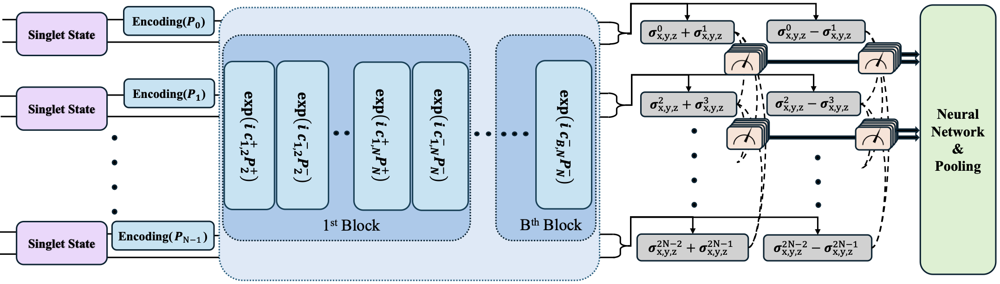
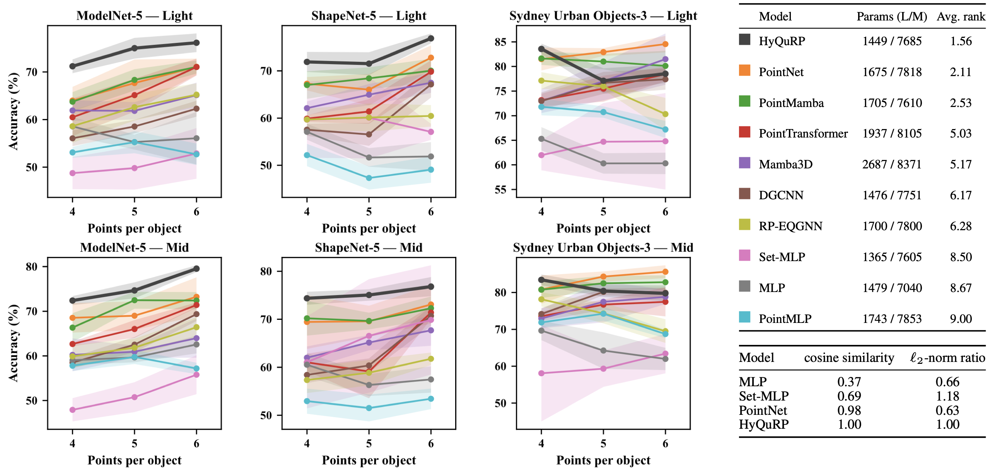

# HyQuRP

## Introduction
HyQuRP is a hybrid quantum–classical neural network for 3D point clouds that maintains rotational and permutational equivariance in its representations, enabling rotation- and permutation-invariant classification. We show that HyQuRP outperforms most classical and quantum state-of-the-art models on various datasets in the sparse point regime.


<p align="center">
  
</p>




**Key Results**
| Dataset | #Points | Params | HyQuRP (acc) | Best baseline (acc) |
|---|---:|---:|---:|---:|
| ModelNet | 6 | ~1K | XX.XX | XX.XX |
| ShapeNet | 6 | ~1K | XX.XX | XX.XX |
| Sydney Urban Objects | 6 | ~1K | XX.XX | XX.XX |

---

## Installation (I will check)

```bash
git clone https://github.com/<USER>/<REPO>.git
cd <REPO>
python3 -m pip install -U pip
python3 -m pip install -r requirements.txt
python3 -m pip uninstall -y jax jaxlib jax-cuda12-plugin jax-cuda12-pjrt jax_plugins # Cleanup (for clarity)
python3 -m pip install -r requirements-jax-cuda12.txt
```

This installs the CUDA 12 JAX backend required to run the JAX-based models (HyQuRP, RP-EQGNN, Set-MLP) on GPU.

---


## Data

We use three object-level datasets with small-class subsets:

- **ModelNet-5**: bottle, bowl, cup, lamp, stool  
- **ShapeNet-5**: birdhouse, bottle, bowl, bus, cap  
- **Sydney Urban Objects-3 (SUO-3)**: car, traffic sign, pedestrian

### Download & place raw data

> After downloading, place the raw dataset folders under the paths below.

#### ModelNet (HDF5)

We use the ModelNet40 HDF5 release.

Download :
- https://huggingface.co/datasets/Msun/modelnet40/tree/d5dc795541800feeb7a4b3bd3142729a0d2adf7a

Put the extracted HDF5 folder under:

```text
data/ModelNet/modelnet40_ply_hdf5_2048/
  ply_data_train0.h5
  ply_data_train1.h5
  ...
  ply_data_test0.h5
  ...
```

#### ShapeNet (OBJ)

Download :
- https://huggingface.co/datasets/ShapeNet/ShapeNetCore/tree/main

Put synset folders under:

```text
data/ShapeNet/
  02843684/  # birdhouse
    <instance_id>/models/model_normalized.obj
  02876657/  # bottle
    <instance_id>/models/model_normalized.obj
  02880940/  # bowl
    <instance_id>/models/model_normalized.obj
  02924116/  # bus
    <instance_id>/models/model_normalized.obj
  02954340/  # cap
    <instance_id>/models/model_normalized.obj
```

#### Sydney Urban Objects 

Download :
- https://www.acfr.usyd.edu.au/papers/SydneyUrbanObjectsDataset.shtml

Put the extracted dataset under:

```text
data/Sydney_Urban_Objects/sydney-urban-objects-dataset/
  objects/
    car/ ...
    traffic_sign/ ...
    pedestrian/ ...
```

### Create NPZ files (sampling)

Each dataset folder provides a sampling script. The only required argument is `--num_points`.

From the repository root:

```bash
python <sampling_script.py> --num_points <NUM_POINTS>
```
- `<sampling_script.py>` : one of `data/ModelNet/modelnet_sampling.py`, `data/ShapeNet/shapenet_sampling.py`, `data/Sydney_Urban_Objects/SUO_sampling.py`

- `<NUM_POINTS>` : number of points per sample (e.g., 3, 4, 5, ...)

Example:
```bash
python data/ModelNet/modelnet_sampling.py --num_points 6
```

The generated `.npz` files will be saved into the corresponding dataset folder:

- `data/ModelNet/`
- `data/ShapeNet/`
- `data/Sydney_Urban_Objects/`


---

## HyQuRP Matrices

HyQuRP uses precomputed (normalized) permutation matrices stored in `HyQuRP/PermMatrix/`.

Generate them by running `HyQuRP/create_perm_matrix_normalized.py` once per `num_qubit`.

### Generate matrices

From the repository root:

```bash
python HyQuRP/create_perm_matrix_normalized.py --num_qubit <NUM_QUBIT>
```
>Note: the matrices have shape `(2**num_qubit, 2**num_qubit)`, so large num_qubit can be very memory/time intensive.

Example:
```bash
python HyQuRP/create_perm_matrix_normalized.py --num_qubit 8
```


Running the script will create / update:

- `HyQuRP/PermMatrix/perm_matrix_{num_qubit}_{num_perm}_plus_normalized.npy`
- `HyQuRP/PermMatrix/perm_matrix_{num_qubit}_{num_perm}_minus_normalized.npy`

where `num_perm` ranges from 2 to `(num_qubit // 2)`.

---

## HyQuRP & baselines

> Make sure the corresponding `.npz` file already exists under:
> `data/ModelNet/`, `data/ShapeNet/`, or `data/Sydney_Urban_Objects/`.


### Run HyQuRP

From the repository root:

```bash
python HyQuRP/HyQuRP.py <SEED> --dataset <DATASET> --num_qubit <NUM_QUBIT> --variant <VARIANT>
```

> Make sure the precomputed HyQuRP matrices are available in `HyQuRP/PermMatrix/`.

- `<DATASET>`: `modelnet`, `shapenet`, or `suo`
- `<VARIANT>`: `light` or `mid`
- `num_points = num_qubit // 2` (so `NUM_QUBIT` must be even)

### Run baselines

All baseline scripts live under `baselines/`. Use the same core flags:

```bash
python baselines/<BASELINE_MODEL>.py <SEED> --dataset <DATASET> --num_qubit <NUM_QUBIT> --variant <VARIANT> [--extra_args ...]
```

- `<BASELINE_MODEL>`: the baseline script name (e.g., `DGCNN`, `PointNet`, ...)
- Some baselines may require extra arguments (e.g., `--k <K>` for kNN-based models).

Example:
```bash
python baselines/DGCNN.py 2026 --dataset modelnet --num_points 6 --variant light --k 3
```

Each script prints validation progress and reports the final Test Overall Accuracy at the end.


---

## Results

